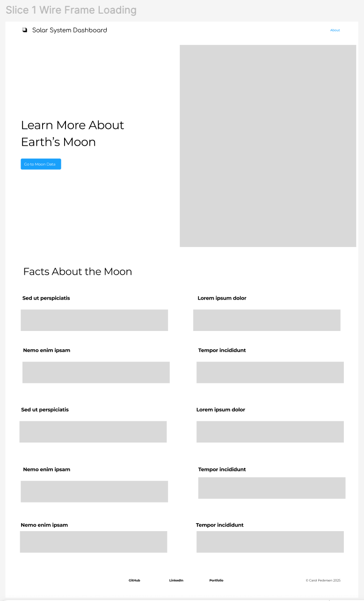
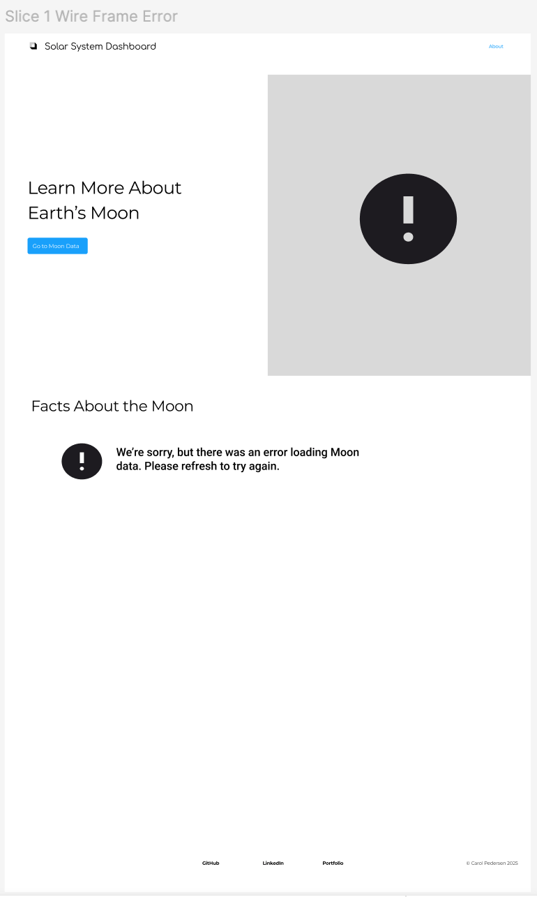

# Moon Dashboard – Cypress Test Plan (Iteration 1)

## Design Reference

Wireframes for **Slice 1 – Hero + Moon Facts View**

These illustrate the three primary UI states under test:
1. **Success** – data loads correctly and displays Moon facts  
2. **Loading** – MUI Skeleton placeholders are visible during fetch  
3. **Error** – user-friendly error message appears if data fails to load

| State | Preview |
|-------|----------|
| **Success** |  |
| **Loading** |  |
| **Error** |  |

> These wireframes were designed in Figma to define the layout and expected component behavior for iteration 1.  
> The circular Hero image in the Success and Loading states references:  
> [Pixabay Full Moon Image](https://images-assets.nasa.gov/image/GSFC_20171208_Archive_e001982/GSFC_20171208_Archive_e001982~orig.jpg?w=1536&h=864&fit=clip&crop=faces%2Cfocalpoint)

---

## 1. Overview
**Feature:** Earth’s Moon Hero section and data view  
**Page/Route:** `/` (home page)  
**Goal:** When the user opens the app, they first see a Hero section introducing Earth’s Moon, followed by accurate, labeled data fetched from the Le Système Solaire API.

Tech stack:  
- Vite + React + TypeScript  
- React Query for data fetching  
- MUI for layout and styling (Grid, Typography, Skeletons, etc.)  
- React Router (for future navigation)  
- Cypress for end-to-end testing with `cy.intercept()` fixtures  

---

## 2. Scope of Iteration 1

### In scope
- **Hero section (from Figma wireframe):**
  - Site title “Solar System Dashboard” and “About” link in header.
  - Headline: “Learn More About Earth’s Moon.”
  - CTA button labeled “Go to Moon Data.”
  - Circular image on the right side loaded from Pixabay:  
    [Full Moon Photo – Pixabay](https://images-assets.nasa.gov/image/GSFC_20171208_Archive_e001982/GSFC_20171208_Archive_e001982~orig.jpg?w=1536&h=864&fit=clip&crop=faces%2Cfocalpoint)
- **Moon facts section:**
  - Fetching Moon data from `/rest/bodies/lune`.
  - Displaying these core fields in a structured layout:
    • English Name (“Moon”)  
    • Body Type (“Moon”)  
    • Around Planet (“Earth”)  
    • Mass (value + exponent → `7.346 × 10²² kg`)  
    • Mean Radius (km)  
    • Gravity (m/s²)  
    • Density (g/cm³)  
    • Orbital Period (sideralOrbit, days)  
    • Rotation Period (sideralRotation, hours)  
    • Escape Velocity (m/s)
- **Skeleton loading state** using MUI `<Skeleton>` components.
- **Error state** with a user-friendly message.
- Basic accessibility (semantic regions, aria-busy).

### Out of scope
- Other planets or moons  
- Navigation to `/moon` or comparison pages  
- Charts, graphs, or animations  

---

## 3. User Story & Acceptance Criteria

> **As a user**,  
> I want to land on an attractive page introducing Earth’s Moon and then view key facts about it  
> **so that** I can learn about the Moon quickly and clearly.

### Acceptance Criteria

1. **Hero section**
   - Displays header with site title and “About” link.
   - Shows headline: “Learn More About Earth’s Moon.”
   - Displays the circular Moon image (sourced from Pixabay).
   - Includes a CTA button “Go to Moon Data” that scrolls or jumps to the Moon facts section.
2. **Moon facts section**
   - Automatically fetches Moon data from the API when the user visits `/`.
   - Displays all listed fields with labels and units.
3. **Skeleton loading state**
   - Visible MUI Skeleton components occupy space while data is loading.
   - Skeletons disappear once real data is displayed.
4. **Error state**
   - User sees a clear, readable error message if the fetch fails.
5. **Accessibility**
   - Hero uses semantic `<header>`; facts section uses `<main>` / `<section>` with proper headings.
   - Loading state uses `aria-busy="true"` while fetching.

---

## 4. Test Strategy

All tests for this iteration live in:

- `cypress/e2e/moon.cy.ts`

**Testing setup**
- Use `cy.intercept()` to stub the API response.
- Store fixtures in `cypress/fixtures/` (e.g. `moon.json`).
- Run tests locally (`npx cypress open`) and in CI via GitHub Actions (headless).

---

## 5. End-to-End Test Cases

### MD-000 – Displays Hero section and CTA navigation
**Goal:** Verify Hero layout, image presence, and CTA behavior.

**Steps**
1. Visit `/`.
2. Assert header shows “Solar System Dashboard” and “About”.
3. Assert headline “Learn More About Earth’s Moon” is visible.
4. Assert the Hero image (NASA url) is rendered correctly and visible.
5. Assert button “Go to Moon Data” is visible and clickable.
6. Click the button.
7. Assert that the page scrolls or jumps to the “Facts About the Moon” section (e.g., `#moon-facts`).

**Expected Result**  
Hero section renders on page load with correct text, image, and CTA. Clicking “Go to Moon Data” navigates smoothly to the Moon facts area.

---

## MD-001 – Shows Skeleton loaders while data is fetching
**Goal:** Verify that Skeleton placeholders appear during loading and clear once data arrives.

**Steps**
1. Stub `GET **/bodies/lune` with:
    { fixture: 'moon.json', delay: 1500 }
2. Visit `/`.
3. Immediately assert Skeleton elements are visible  
   (e.g. elements with `role="progressbar"`).
4. Assert that no Moon data fields (labels or values like “Mass”, “Gravity”) are visible yet.
5. After `cy.wait('@getMoon')`, assert:
   - Skeletons are no longer visible.
   - At least one Moon data field is now visible (e.g. “Gravity”).

**Expected Result**  
Skeletons appear while the request is in flight, then disappear once data is loaded, and the UI does not get “stuck” in a loading state.

---

## MD-002 – Displays Moon data after successful load
**Goal:** Confirm the success state shows all Moon data with correct labels and formatting.

**Steps**
1. Stub `GET **/bodies/lune` to return `moon.json` (no delay).
2. Visit `/`.
3. Wait for the API request to complete (e.g. `cy.wait('@getMoon')`).
4. Assert that a heading like “Facts About the Moon” is visible.
5. Assert labeled fields and formatted values appear, for example:
   - Mass: `7.346 × 10²² kg`
   - Mean Radius: `1737.4 km`
   - Gravity: `1.62 m/s²`
   - Density: `3.34 g/cm³`
   - Sideral Orbit: `27.32 days`
   - Sideral Rotation: `655.72 hours`
   - Escape Velocity: `2380 m/s`
6. Assert that no Skeleton components are visible.
7. Assert that no error message is visible.

**Expected Result**  
The final success state shows all Moon data correctly labeled and formatted, with only the “real” content on screen (no loaders, no errors).

---

## MD-003 – Shows error message on API failure
**Goal:** Ensure the UI handles failed API calls gracefully.

**Steps**
1. Stub `GET **/bodies/lune` to return an error response (e.g. `statusCode: 500`).
2. Visit `/`.
3. Assert that a visible error message appears, such as:  
   “Unable to load Moon data. Please try again later.”
4. Assert that:
   - No Skeletons are visible.
   - No Moon data fields (labels or values) are rendered.

**Expected Result**  
A friendly error message is shown, and the user does not see partial or stale data.

### MD-004 – Accessibility structure
**Goal:** Verify semantic structure and accessibility.

**Steps**
1. Stub API → `moon.json`.
2. Visit `/`.
3. Assert that the page has:
   - `<header>` with navigation and title.
   - `<main>` region with Moon facts.
   - Proper heading hierarchy (`h1` / `h2`).
4. Ensure Skeleton components use `aria-busy="true"` during loading and are removed when finished.

**Expected Result**  
Accessible layout with identifiable regions, headings, and compliant loading indicators.

---

## 6. Fixture – `moon.json`
*(example fixture content for reference)*

    {
      "id": "lune",
      "name": "La Lune",
      "englishName": "Moon",
      "isPlanet": false,
      "bodyType": "Moon",
      "aroundPlanet": {
        "planet": "earth",
        "rel": "https://api.le-systeme-solaire.net/rest/bodies/terre"
      },
      "mass": {
        "massValue": 7.346,
        "massExponent": 22
      },
      "meanRadius": 1737.4,
      "gravity": 1.62,
      "density": 3.34,
      "sideralOrbit": 27.321661,
      "sideralRotation": 655.72,
      "escape": 2380
    }

### Data contracts & display rules
| Field | Display Label | Format |
|---|---|---|
| englishName | Name | "Moon" (text) |
| bodyType | Type | "Moon" (text) |
| aroundPlanet.planet | Orbits | "Earth" (capitalized) |
| mass.massValue + mass.massExponent | Mass | `7.346 × 10²² kg` |
| meanRadius | Mean Radius | `1737.4 km` |
| gravity | Gravity | `1.62 m/s²` |
| density | Density | `3.34 g/cm³` |
| sideralOrbit | Orbital Period | `27.32 days` |
| sideralRotation | Rotation Period | `655.72 hours` |
| escape | Escape Velocity | `2380 m/s` |

---

## 7. Future Extensions (Not in this iteration)
- **MD-005 –** Animate Hero image or add responsive background  
- **MD-006 –** Navigate to `/moon` detail route  
- **MD-007 –** Compare Moon with planets (chart view)  
- **MD-008 –** Responsive layout and viewport tests (`cy.viewport()`)

---

## 8. Summary
Iteration 1 delivers a full vertical slice of the Moon Dashboard:  
- Engaging **Hero section** (title, image, CTA)  
- Accurate **Moon data** displayed in a responsive MUI layout  
- **Skeleton loaders** for smooth loading transitions  
- **Error state** and **accessibility compliance**  
- All behavior covered by Cypress tests (MD-000 → MD-004)

Once all tests pass locally and in CI, Iteration 1 is complete and ready for demo or next-slice expansion.
